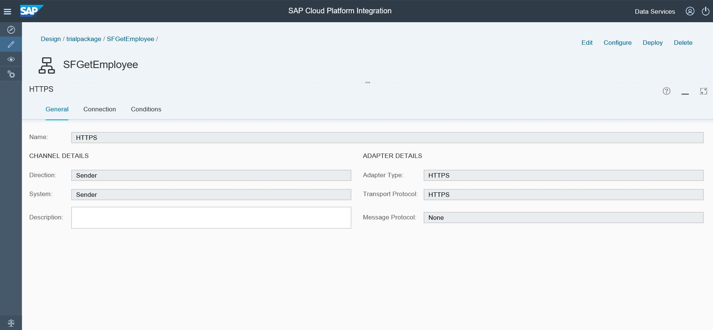

# Integrate a Chatbot with SAP Successfactors using SAP Cloud Platform Integration
Sample of integration between SAP Conversational AI chatbot and SAP Successfactors by using SAP Cloud Platform Integration

## Table of contents
<!-- TOC depthFrom:3 depthTo:6 withLinks:1 updateOnSave:1 orderedList:0 -->

- [Getting Started](#getting-started)
- [You will learn](#you-will-learn)
- [Scope & Scenario](#scope-scenario)
- [Prerequisites](#prerequisites)
	- [1. Basic understanding of chatbot development in CAI](#1-basic-understanding-of-chatbot-development-in-cai)
	- [2. SAP Cloud Platform Integration (CPI) account](#2-sap-cloud-platform-integration-cpi-account)
- [Deployment](#deployment)
	- [STEP 1: Chatbot Preparation](#step-1-chatbot-preparation)
	- [STEP 2: Create and Deploy Credential Artifact in CPI](#step-2-create-and-deploy-credential-artifact-in-cpi)
	- [STEP 3: Create Integration Flow Artifact](#step-3-create-integration-flow-artifact)
		- [Participants - Sender](#participants-sender)
		- [Events - Start Message](#events-start-message)
		- [Connectors - HTTPS Adapter](#connectors-https-adapter)
		- [Message Transformers - Script - Javascript](#message-transformers-script-javascript)
		- [Call - External Call - Request Reply](#call-external-call-request-reply)
		- [Participants - Receiver](#participants-receiver)
		- [Connectors - Successfactors adapter](#connectors-successfactors-adapter)
		- [Participants - Receiver](#participants-receiver)
		- [Message Routing - Router](#message-routing-router)
		- [Message Transformers - Content Modifier 1](#message-transformers-content-modifier-1)
		- [Message Transformers - Content Modifier 2](#message-transformers-content-modifier-2)
		- [Message Transformers - Script - Groovy Script 1 & 2](#message-transformers-script-groovy-script-1-2)
		- [Events - End Message 1 & 2](#events-end-message-1-2)
		- [Integration Runtime Configuration](#integration-runtime-configuration)
	- [STEP 4: Deploy the Artifact](#step-4-deploy-the-artifact)
	- [STEP 5: Set Chatbot to Call CPI Artifact Endpoint as Webhook](#step-5-set-chatbot-to-call-cpi-artifact-endpoint-as-webhook)
	- [STEP 6: Test Your Chatbot](#step-6-test-your-chatbot)

<!-- /TOC -->
### Getting Started

This document is inspired by a tutorial of chatbot integration with third party system (MovieDB) in SAP Conversational AI (CAI). Integration is done by using SAP Cloud Platform Integration (CPI).

  https://cai.tools.sap/blog/integrate-a-chatbot-with-a-third-party-system-moviedb-using-sap-cloud-platform-integration/

On the same day, SAP announced the availability of CPI in Cloud Foundy environment. The good news is, the service is available for the trial account!

  https://blogs.sap.com/2019/06/19/sap-cloud-platform-integration-is-now-available-on-cloud-foundry-cf-environment/

With this, anyone with trial account will be able to explore CPI.

There are still some limitations on CPI under Cloud Foundry environment compare to Neo environment. However, it is good enough to fulfill the scenario that is used in this document.

### You will learn

1. Create and deploy credential artifact in CPI

2. Create and deploy integration flow (iflow) artifact in CPI.
  You will use various elements in CPI WebUI e.g. HTTPS adapter, Successfactors adapter, Javascript, Groovy script, Request Reply, Router and Content Modifier

3. Configure bot skill to call CPI endpoint.

### Scope & Scenario

An iflow artifact with HTTPS adapter web service will be deployed in CPI to be used by SAP CAI chatbot as webhook.

User will interact with the chatbot by giving input of Successfactors employee/user ID.

This user ID information will be used by CPI iflow artifact to get the detail information from Successfactors e.g. fullname, position title and department and will return the information back to the chatbot.

### Prerequisites

#### 1. Basic understanding of chatbot development in CAI

You can refer to tutorials in SAP Conversational AI website. I recommend these two tutorials.

  https://cai.tools.sap/blog/build-your-first-bot-with-sap-conversational-ai/

  https://cai.tools.sap/blog/integrate-a-chatbot-with-a-third-party-system-moviedb-using-sap-cloud-platform-integration/


#### 2. SAP Cloud Platform Integration (CPI) account

You can use one, either in SAP Cloud Platform Neo environment or Cloud Foundry environment.

This document uses CPI Cloud Foundry trial account.
You may refer to below blog on how to setup one:  

  https://blogs.sap.com/2019/06/10/self-service-enablement-of-cloud-integration-service-on-cloud-foundry-environment/


### Deployment

Below are steps for the deployment.

#### STEP 1: Chatbot Preparation

In SAP Conversational AI, create a skill for your chatbot to get input from conversation and store it as variable. In my case, it is stored as *userid*.

We will use this variable later to search employee detail information from Successfactors.


Note down also the *bot request token*. The information can be found in *Bot Settings*.

**Result:**  
You have created a skill and have variable to store input of employee/user ID. You also have the bot request token information.

#### STEP 2: Create and Deploy Credential Artifact in CPI

Below is where you create and deploy credential artifact in CPI. The credential will be used when we create Successfactors adapter in iflow later.


Note down the credential name as you will need it later when you configure Successfactors adapter in iflow.

**Result:**  
You have created and deployed a credential artifact in CPI.


#### STEP 3: Create Integration Flow Artifact

The screenshot below is how the final CPI iflow artifact looks like.


To create an artifact you need to choose existing package or create a new one.


To create a new iflow artifact, click on Add button and choose Integration Flow.


Below are details of elements and properties to be created in CPI WebUI.

##### Participants - Sender


##### Events - Start Message


##### Connectors - HTTPS Adapter
HTTPS Adapter element needs to be created between Sender and Start Message element.



Address in the HTTPS connection property will become the endpoint of URL address later.


##### Message Transformers - Script - Javascript


This Javascript is used to parse the JSON from SAP CAI chatbot.
The raw value of object *userid* in JSON will be stored as *lm_userid* in CPI.
```
/*
* The integration developer needs to create the method processData
 This method takes Message object of package com.sap.gateway.ip.core.customdev.util
 which includes helper methods useful for the content developer:
 The methods available are:
    public java.lang.Object getBody()
	public void setBody(java.lang.Object exchangeBody)
   public java.util.Map<java.lang.String,java.lang.Object> getHeaders()
    public void setHeaders(java.util.Map<java.lang.String,java.lang.Object> exchangeHeaders)
    public void setHeader(java.lang.String name, java.lang.Object value)
    public java.util.Map<java.lang.String,java.lang.Object> getProperties()
    public void setProperties(java.util.Map<java.lang.String,java.lang.Object> exchangeProperties)
 */

 importClass(com.sap.gateway.ip.core.customdev.util.Message);
 importClass(java.util.HashMap);


 function processData(message) {
     var body = message.getBody(java.lang.String);
     var myObj = JSON.parse(body);
     var lm_userid = myObj.conversation.memory.userid.raw;

     message.setProperty("lm_userid", lm_userid);

     message.setHeader("Accept","application/json");
     message.setHeader("Content-Type","application/json");

 	return message;
 }

```
##### Call - External Call - Request Reply
Request Reply element is used to make a call to external system. In this case, we will use Successfactors as the external system.


##### Participants - Receiver


##### Connectors - Successfactors adapter
Successfactors Adapter needs to be created to connect Request Reply and Receiver.


Address is the URL of Successfactors API. Credential is the one created in [STEP 2: Create and Deploy Credential Artifact in CPI](#step-2-create-and-deploy-credential-artifact-in-cpi)


Output from this call will be in xml format.

##### Participants - Receiver


##### Message Routing - Router
There are two possibilities of results when we make OData call to Successfactors: employee/user ID does not exist OR does exist.

Router can be used to define conditional checking and give different reply into conversation.


Default routing is set to *userId does not exist* branch.
Condition checking that is used to check if there is element *userId* in xml is *count(//userId) > 0*

##### Message Transformers - Content Modifier 1
This is where we parse the xml and map the elements into message property.

Token is bot request token from [STEP 1: Chatbot Preparation](#step-1-chatbot-preparation).


In this Exhange Property, we map xml element to CPI message property.


In Message Body, we define the reply to the bot. JSON format should be based on the CAI standard format.
```
{
  "replies": [
    {
      "type": "list",
        "content": {
          "elements": [{
              "title": "${property.lv_defaultFullName}",
              "imageUrl": "https://########.cfapps.eu10.hana.ondemand.com/assets/photoNotAvailable.gif",
              "subtitle": "${property.lv_title} / ${property.lv_department}",
              "buttons": [{
                      "title": "PeopleView",
                      "type": "web_url",
                      "value": "https://########.successfactors.eu/sf/orgchart?selected_user=${property.lv_userId}&company=########&username=${property.lv_userId}"
              }]
          }]
        }
    }
  ]
}
```

##### Message Transformers - Content Modifier 2
This is where we set reply if employee/user ID is not found.


```
{
  "replies": [
    {
      "type": "text",
      "content": "ID ${property.lm_userid} not found!"
    }
  ]
}
```

##### Message Transformers - Script - Groovy Script 1 & 2
The two elements are using same Groovy script which can be useful to see how the payload looks like at the end of the iflow. I am using same Groovy script as the one in the 2nd tutorial in Prerequisites [1. Basic understanding of chatbot development in CAI](#1-basic-understanding-of-chatbot-development-in-cai).


```
/*
 The integration developer needs to create the method processData
 This method takes Message object of package com.sap.gateway.ip.core.customdev.util
which includes helper methods useful for the content developer:
The methods available are:
    public java.lang.Object getBody()
	public void setBody(java.lang.Object exchangeBody)
    public java.util.Map<java.lang.String,java.lang.Object> getHeaders()
    public void setHeaders(java.util.Map<java.lang.String,java.lang.Object> exchangeHeaders)
    public void setHeader(java.lang.String name, java.lang.Object value)
    public java.util.Map<java.lang.String,java.lang.Object> getProperties()
    public void setProperties(java.util.Map<java.lang.String,java.lang.Object> exchangeProperties)
    public void setProperty(java.lang.String name, java.lang.Object value)
    public java.util.List<com.sap.gateway.ip.core.customdev.util.SoapHeader> getSoapHeaders()
    public void setSoapHeaders(java.util.List<com.sap.gateway.ip.core.customdev.util.SoapHeader> soapHeaders)
       public void clearSoapHeaders()
 */

import com.sap.gateway.ip.core.customdev.util.Message;
import java.util.HashMap;
import com.sap.it.api.mapping.*;
import java.text.SimpleDateFormat;
import java.util.Calendar;


def Message processData(Message message) {

	map = message.getProperties();
	property_ENABLE_PAYLOAD_LOGGING = "TRUE";
	if (property_ENABLE_PAYLOAD_LOGGING.toUpperCase().equals("TRUE")) {
		def header = message.getHeaders() as String;
		def body = message.getBody(java.lang.String) as String;

		String timeStamp = new SimpleDateFormat("HH:mm:ss.SSS").format(new Date());
		String logTitle = timeStamp + " JSstep ";

		def messageLog = messageLogFactory.getMessageLog(message);
		if (messageLog != null) {
			messageLog.addAttachmentAsString(logTitle, body, "text/xml");
		}
	}
	return message;
}
```

##### Events - End Message 1 & 2


##### Integration Runtime Configuration
In the Runtime Configuration of Integration flow, set HTTP session reuse as per the screenshot. Without this setting, the adapter will throw an error due to pagination defined in SuccessFactors.


**Result:**  
You have created an integration flow artifact in CPI.


#### STEP 4: Deploy the Artifact


Upon successful deployment you will be able to see it in the Operations View.


Note down the Endpoints URL as we will use it in CAI.

Log level under Log Configuration can be set to have more details step by step information if required.

**Result:**  
Your CPI artifacts is deployed successfully.


#### STEP 5: Set Chatbot to Call CPI Artifact Endpoint as Webhook
In this step, we need to configure the Action of the bot skill in SAP Conversational AI.


Enter the CPI endpoint from [STEP 4: Deploy the Artifact](#step-4-deploy-the-artifact) as webhook URL. In this example, I put the complete URL of endpoint. However, if you defined the URL prefix in bot settings, then you can just put */get_employee* in the URL.

The authentication is your CPI account. If you use Process Integration Runtime (it-rt) service instance as per tutorial in Prerequisites [2. SAP Cloud Platform Integration (CPI) account](#2-sap-cloud-platform-integration-cpi-account), then you need to use key that is generated in it-rt service instance.

Below is for reference on the it-rt service instance and service key:


**Result:**  
Bot skill Action is configured and will call CPI artifact endpoint.

#### STEP 6: Test Your Chatbot

**Result:**  


In CPI, you can monitor and trace the message processing in Operations View.


That's all. Hope you find it useful!
